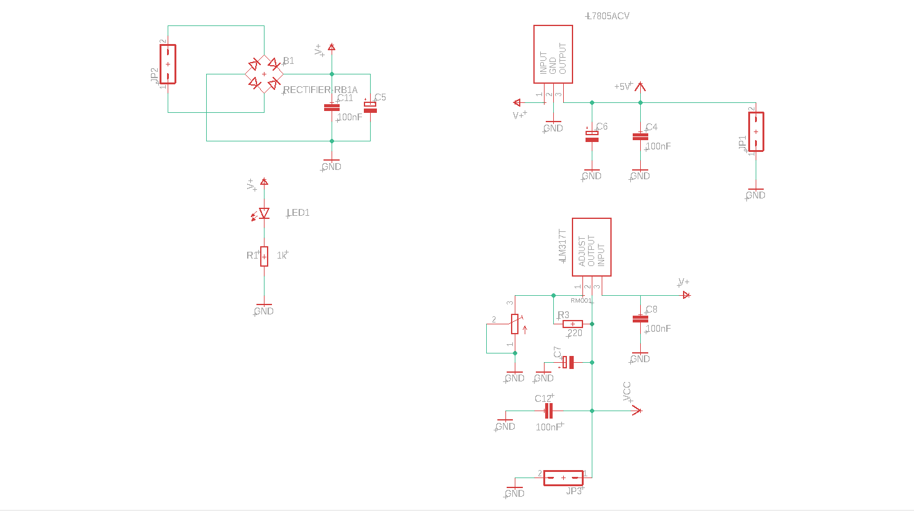
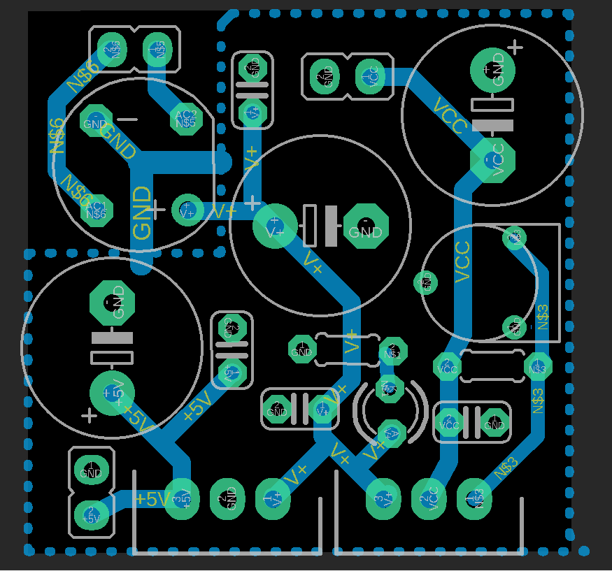
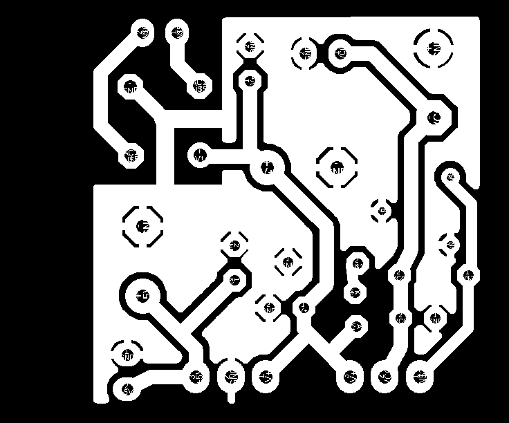
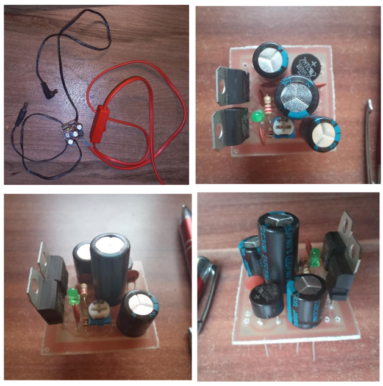

# Stabilizowany zasilacz - Eagle Autodesk

## Opis projektu
Celem projektu jest zaprojektowanie w Eagle Autodesk i wytworzenie płytki obwodu
drukowanego dla regulowanego stabilizowanego zasilacza laboratoryjnego.

## Schemat elektryczny

## Rozmieszczenie elementów i ścieżek

## Wykonany zasilacz , rozmiar 30x30mm

## Wykaz Elementów

| Symbol   | Nazwa, oznaczenie                        | Ilość |
|----------|------------------------------------------|-------|
| C1, C2, C3, C4 | Kondensator, 100nF, 50V              | 4     |
| C6, C7   | Kondensator, Jamicon, 470uF, 25V        | 2     |
| C5        | Kondensator, Jamicon, 1000uF, 25V      | 1     |
| R1        | Rezystor, R1/4W5%220R                   | 1     |
| R2        | Rezystor, R1/4W5%1k                     | 1     |
| R3        | Potencjometr, RM065 RM-P2, 5x5-502     | 1     |
| IC1       | Stabilizator, ST Microelectronics L7805ACV | 1  |
| IC2       | Stabilizator, ST Microelectronics LM317TT | 1  |
| LED1      | Dioda LED, Yetda Q300HCG1G             | 1     |
| B1        | Mostek prostowniczy, RB157              | 1     |

## Wymagania dotyczące tego obwodu są następujące:
1. Sygnalizacja działania układu: Obwód powinien być wyposażony w diodę
sygnalizacyjną, która wskazuje, czy układ jest włączony i działa
poprawnie.
2. Małe wymiary zewnętrzne: Płytkę obwodu należy zaprojektować tak, aby
jej wymiary były możliwie jak najmniejsze oraz nie utrudniały ręcznego
montażu elementów.
3. Stabilizatory z możliwością montażu radiatora: Stabilizatory zostaną
umieszczone w taki sposób, aby można było dołączyć dodatkowy radiator
w celu efektywnego odprowadzenia ciepła.
4. Brak transformatora: Zasilanie zewnętrzne będzie dostarczane prądem
przemiennym o napięciu do 12V.
5. Zastosowanie rozlanej masy: W projekcie należy uwzględnić
zastosowanie rozlanej masy w celu zwiększenia stabilności i
odprowadzenia ciepła.
6. Układ filtrujący: Zasilacz będzie wyposażony w odpowiedni układ
filtrujący, który pozwoli na uzyskanie czystego napięcia wyjściowego.
7. Jednostronnie wykonana płytką: Płytka obwodu będzie wykonana
metodą grawerowania i trawienia, przy czym będzie to jednostronnie
wykonana płytką drukowaną.
8. Regulowane napięcie wyjściowe: Napięcie wyjściowe będzie można
regulować przy użyciu potencjometru, w zakresie od 2,5V do 12V.
Zadanie polega na zaprojektowaniu i wytworzeniu płytki obwodu
drukowanego, która spełni powyższe wymagania

